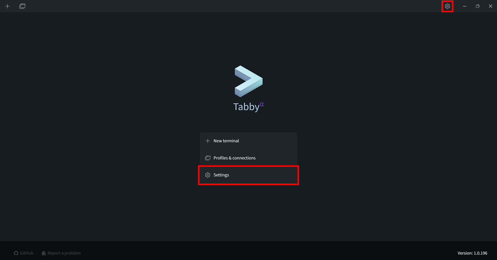
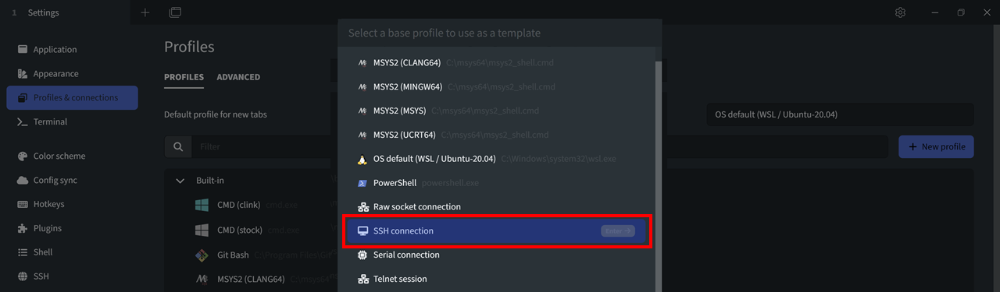
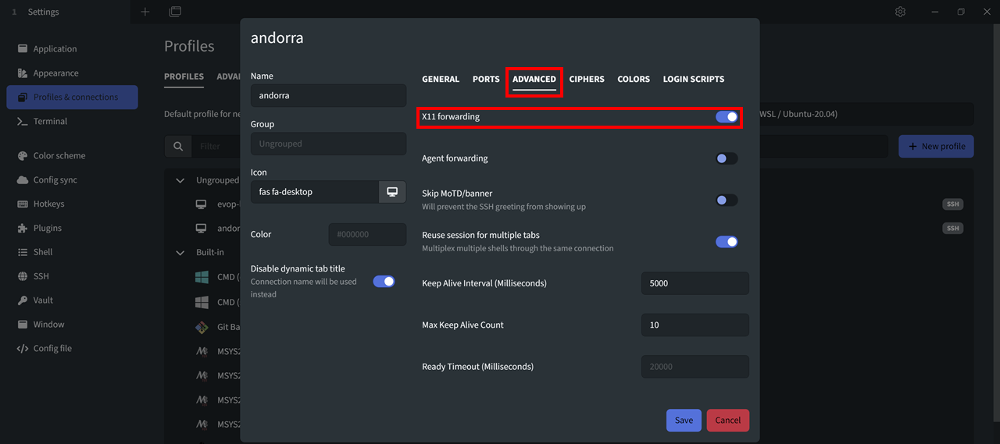
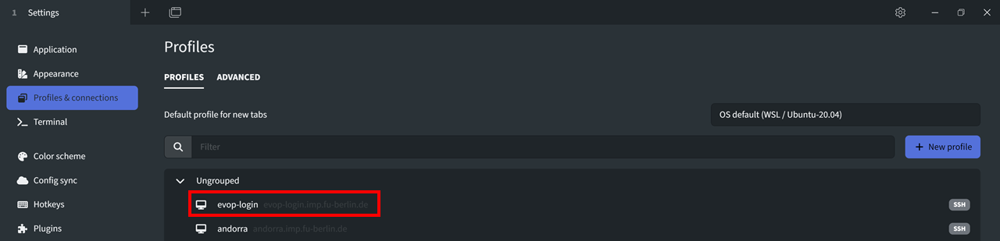

# Starting terminal

## Opening terminal

### Windows

Unfortunately, Windows comes with `Command prompt` or `Windows PowerShell` which is not of interest for us. However, there are many possibilities for us who have Windows OS to use Unix like terminal (e.g. [Tabby](https://tabby.sh/), [MobaXterm](https://mobaxterm.mobatek.net/), [Ubuntu on Windows 10](https://ubuntu.com/tutorials/tutorial-ubuntu-on-windows#1-overview), [Babun](https://babun.github.io/), [Putty Manager](http://puttymanager.sourceforge.net/), [Cygwin](https://www.cygwin.com/), and many others)! For this tutorial we will use Tabby.


### Mac

The Mac command-line is a program called **Terminal**. It is located in the `/Applications/Utilities/` folder. To find it, go to your `Applications` folder. Near the bottom, you should find a folder called `Utilities`. Go inside, and one of the applications listed is called `Terminal`. Double-click that application to open it.

### Linux

To find it, click on `Applications` and search for `Terminal` or `Konsole`.

Go ahead and open the **command-line**. When you open it you will see a new window, with a simple [prompt](https://en.wikipedia.org/wiki/Command-line_interface#Command_prompt) which indicates that the shell is ready for the input.

------------------------------------------------------------------------

# Tabby

Considering that you are using different kinds of OS we will use the Tabby terminal app which runs on Windows, Mac, and Linux. This way everyone will be able to follow tutorials without much difficulty (hopefully).


[Tabby](https://tabby.sh/) is an infinitely customizable, free, cross-platform terminal app for local shells, serial, SSH, and Telnet connections. It runs on Windows, Mac, and Linux.

---

## Downloading and Installing

Follow [this YouTube tutorial for installing Tabby on Windows/Linux/MacOS](https://www.youtube.com/watch?v=G03-5RE0ohg&t=2s). You can also find short summary of the steps below.

### Windows

1. Go to `https://github.com/Eugeny/tabby/releases/tag/v1.0.196`.
2. Click on [tabby-1.0.196-setup-x64.exe](https://github.com/Eugeny/tabby/releases/download/v1.0.196/tabby-1.0.196-setup-x64.exe).
3. Once `tabby-1.0.196-setup-x64.exe` is downloaded double-clicking on it and install it.
4. To start the program search for app `Tabby Terminal`.

### Mac

1. Go to `https://github.com/Eugeny/tabby/releases/tag/v1.0.196`.
2. Click on [tabby-1.0.196-macos-x64.pkg](https://github.com/Eugeny/tabby/releases/download/v1.0.196/tabby-1.0.196-macos-x64.pkg).
3. Once `tabby-1.0.196-macos-x64.pkg` is downloaded follow the installer.
4. To start the program search for `Tabby` and open it.

### Linux

[How to install Tabby Terminal on Ubuntu 22.04 Linux](https://linux.how2shout.com/how-to-install-tabby-terminal-on-ubuntu-22-04-linux/)

---

## Connecting to a remote server

We will do most of our exercises on the remote computers (physically located outside of your homes :)) using the `evop-login.imp.fu-berlin.de` server. We can access them through the terminal (or terminal emulator) that you just installed and opened.

So, let's do it! First, we have to open the terminal and then we have to type:

``` bash
ssh -J YourID@andorra.imp.fu-berlin.de YourID@evop-login
```
[SSH](https://wiki.gentoo.org/wiki/SSH) (**S**ecure **SH**ell) is the ubiquitous tool for logging into and working on remote machines securely. All sensitive information is strongly encrypted, and in addition to the remote shell, SSH supports file transfer, and port forwarding for arbitrary protocols, allowing secure access to remote services. 

Two `ssh` options important for us are: 
- `-J` which allows us to jump through a host (from host1 to host2, in our case from `andorra` to `evop-login`).
- `-X` which allows us to execute **graphical** applications remotely. Runing graphical applications remotely is very demanding for the network, so by default, we will NOT use this option during this tutorial.

In addition to the main `ssh` command, the SSH suite of programs includes tools such as:

* `scp` - Secure Copy Program (which we will be using), 
* `sftp` - Secure File Transfer Protocol, or 
* `ssh-agent` to help with key management.


### Setting up `evop-login` connection in Tabby

Luckily Tabby allows us to save connections so we can easily access them.

1. Click on `Settings` in the upper right corner or in the middle panel.



2. Select `Profiles & connections` tab in the left side pane and click on `+ New profile` on the right side.


3. Select `SSH connection` from the dropdown menu.



4. Fill in the fields `Name: andorra`, `Host: andorra.imp.fu-berlin.de`, and `Username: your_ZEDAT_username`, and press `Save`.


5. Click on `+ New profile` and select `SSH connection`


6. Click on `Connection` and in the drop-down menu select `Jump host`. In the newly appeared field `Jump host` select `andorra`. Fill in the rest of the fields `Name: evop-login`, `Host: evop-login.imp.fu-berlin.de`, and `Username: your_ZEDAT_username`, and press `Save`.


7. Now press `Profiles & connections` tab and select the newly created connection `evop-login`, enter passord and you will be connected to `evop-login` server.


8. To allow Tabby's `SFTP` to open our working directory we need to add a line of code in our `.bashrc` file. You can open it by typing `nano ~/.bashrc` and then go to the very end and paste: `export PS1="$PS1\[\e]1337;CurrentDir="'$(pwd)\a\]'`. Exit by pressing `Ctrl+X` and then type `Y` to save changes and press `Enter` to close the file.

9. Now when we open new tab with `evop-login` we will be able to see files and directories in our working directory when we click on `SFTP` located in upper right corner. This way we can easily download files from server to our local computers, and upload files from our local computers to evop-login server.






Now you are set up and we can start learning about the command line!

------------------------------------------------------------------------


