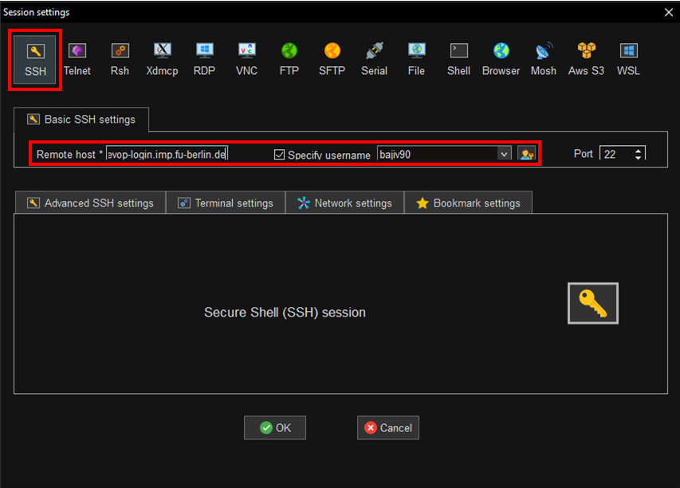
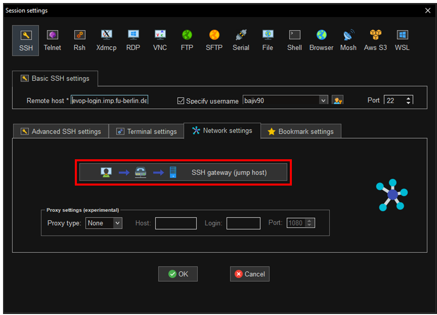
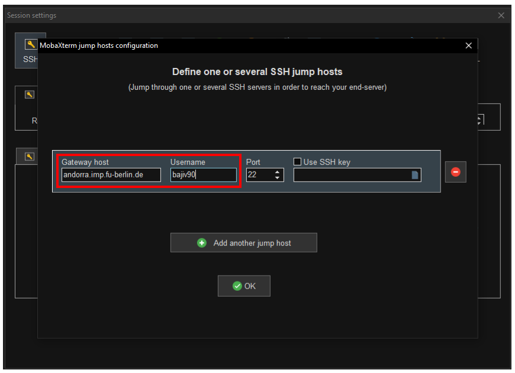

# Starting UNIX terminal

## Opening terminal

------------------------------------------------------------------------


### Windows

Unfortunately, Windows comes with `Command prompt` which is not of
interest for us. However, there are many possibilities for us who have
Windows OS to use Unix like terminal! Here are several options:

-   [Tabby](https://tabby.sh/) - infinitely customizable cross-platform terminal app 
    for local shells, serial, SSH and Telnet connections.

-   [MobaXterm](https://mobaxterm.mobatek.net/) - free, easy to install toolbox for remote computing 
    that provides a command-line interface.

-   [Ubuntu on Windows
    10](https://ubuntu.com/tutorials/tutorial-ubuntu-on-windows#1-overview) -
    free **Windows10** app that provides Ubuntu terminal. Follow the
    instructions on how to install it
    [here](https://www.howtogeek.com/249966/how-to-install-and-use-the-linux-bash-shell-on-windows-10/)

-   [Babun](https://babun.github.io/) - free, easy to install. To use
    it, go to the `Start menu`, select `Programs`, and click on `Babun`.

-   [Putty Manager](http://puttymanager.sourceforge.net/) - extends
    putty and provides multiple tabs and options.

-   [Cygwin](https://www.cygwin.com/) - emulates a whole Unix
    environment. You can execute commands on your computer, or connect
    to a remote server

#### Downloading and Installing MobaXterm

1. Go to `https://mobaxterm.mobatek.net/download-home-edition.html`
2. Click on `MobaXterm Home Edition v23.0 (Portable edition)`
3. Once `MobaXterm_Portable_v23.0.zip` is downloaded unzip it by right-clicking on it and selecting `Extract All..`  
4. To start the program double-click on `MobaXterm_Personal_23.0.exe` that is located in the newly extracted folder `MobaXterm_Portable_v23.0`   

#### Setting up evop-login connection in MobaXterm

1. Click on `Session` in the left upper corner.
2. Select `SSH` tab
3. In `Basic SSH settings` specify `Remote host *` to be `evop-login.imp.fu-berlin.de`, and `Specify username` to be __your ZEDAT username__.



4. Select `Network settings` and click on `SSH gateway (jump host)`



5. When the new window opens specify `Gateway host` to be `andorra.imp.fu-berlin.de` and `Username` to be __your ZEDAT username__.



6. Now you can select `Bookmark settings` to specify `Session name:` to e.g. `evop-login`
7. Now just press `OK` and you will find in the left side panel under `Sessions` a newly created link to `evop-login`. Just double-click on it and you will be logged in to `evop-login` server, and you will see your `home` directory in the left panel.

------------------------------------------------------------------------

### Mac

The Mac command-line is a program called **Terminal**. It is located in
the `/Applications/Utilities/` folder. To find it, go to your
`Applications` folder. Near the bottom, you should find a folder called
`Utilities`. Go inside, and one of the applications listed is called
`Terminal`. Double-click that application to open it.

------------------------------------------------------------------------

### Linux

To find it, click on `Applications` and search for `Terminal` or
`Konsole`.

Go ahead and open the **command-line**. When you open it you will see a
new window, with a simple
[prompt](https://en.wikipedia.org/wiki/Command-line_interface#Command_prompt)
which indicates that the shell is ready for the input.

------------------------------------------------------------------------

## Connecting to a remote server

We will do most of our exercises on the remote computers (physically
located outside of your homes :)) using the
`evop-login.imp.fu-berlin.de` server. We can access them through the
terminal (or terminal emulator) that you just (installed and) opened.

The login to the server is very straight forward for Linux and Mac, but
the Windows can be a bit tricky depending on the software you chose to
install at the beginning (from here on we assume you are using
`MobaXterm` or `Ubuntu on Windows 10 app`).

So, let's do it! First, we have to open the terminal as described before and then we have to type:

``` bash
ssh -J YourID@andorra.imp.fu-berlin.de YourID@evop-login
```
[SSH](https://wiki.gentoo.org/wiki/SSH) (**S**ecure **SH**ell) is the ubiquitous tool for logging into and working on remote machines securely. All sensitive information is strongly encrypted, and in addition to the remote shell, SSH supports file transfer, and port forwarding for arbitrary protocols, allowing secure access to remote services. 

Two `ssh` options important for us are: 
- `-J` which allows us to jump through a host (from host1 to host2, in our case from `andorra` to `evop-login`).
- `-X` which allows us to execute **graphical** applications remotely. Runing graphical applications remotely is very demanding for the network, so by default, we will NOT use this option during this tutorial.

In addition to the main `ssh` command, the SSH suite of programs includes tools such as:

* `scp` - Secure Copy Program (which we will be using), 
* `sftp` - Secure File Transfer Protocol, or 
* `ssh-agent` to help with key management.

------------------------------------------------------------------------